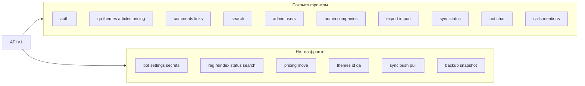
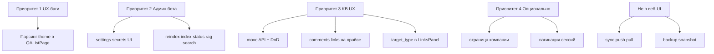

# План: что есть на бэкенде, но нет на фронтенде

Источник маршрутов: [`backend/internal/handler/router.go`](backend/internal/handler/router.go)  
Текущие API-клиенты: [`frontend/src/api/`](frontend/src/api/)

---

## 1. Полностью отсутствует (нет API-клиента и нет UI)

### 1.1 Администрирование бота — 8 эндпоинтов

Роль: `admin` / `superadmin`

| Метод | Путь | Назначение |
|-------|------|------------|
| GET | `/admin/bot/settings` | Настройки бота (persona, provider, guardrails) |
| PUT | `/admin/bot/settings` | Обновление настроек |
| GET | `/admin/bot/secrets` | Статусы секретов (`llm`, `telegram`, `max`, `vk`, `bitrix24`) |
| PUT | `/admin/bot/secrets/{kind}` | Сохранение секрета |
| DELETE | `/admin/bot/secrets/{kind}` | Удаление секрета |
| POST | `/admin/bot/rag/reindex` | Постановка полной переиндексации |
| GET | `/admin/bot/rag/index-status` | Статус очереди индексации |
| POST | `/admin/bot/rag/search` | Отладочный RAG-поиск (vector + hybrid) |

Обработчики: [`backend/internal/handler/bot.go`](backend/internal/handler/bot.go), [`backend/internal/handler/rag.go`](backend/internal/handler/rag.go)  
Контракты: [`backend/internal/service/bot_settings.go`](backend/internal/service/bot_settings.go), [`backend/internal/domain/bot.go`](backend/internal/domain/bot.go)

**Что нужно на фронте:**
- `frontend/src/api/botAdmin.ts` (или `botSettings.ts` + `rag.ts`)
- Типы `BotSettings`, `TenantSecretStatus`, `IndexStatus`, `RetrieveResult` в [`frontend/src/types/models.ts`](frontend/src/types/models.ts)
- Страницы в `settings/` или `bot/`: «Настройки бота», «Секреты», «RAG / Индексация»
- Маршруты в [`frontend/src/App.tsx`](frontend/src/App.tsx) под `ProtectedRoute minimumRole="admin"`
- Пункты в [`frontend/src/components/layout/AppSidebar.tsx`](frontend/src/components/layout/AppSidebar.tsx)

---

### 1.2 Перемещение узла прайса

| Метод | Путь | Тело |
|-------|------|------|
| POST | `/pricing/{id}/move` | `{ "parent_id": "uuid" \| null }` |

Обработчик: [`backend/internal/handler/pricing.go`](backend/internal/handler/pricing.go) (метод `Move`)

**Фронт сейчас:** [`frontend/src/api/pricing.ts`](frontend/src/api/pricing.ts) — только CRUD; дерево в [`frontend/src/pages/pricing/PricingPage.tsx`](frontend/src/pages/pricing/PricingPage.tsx) без drag-and-drop.

**Что нужно:**
- `pricingApi.move(id, { parent_id })`
- UI: перетаскивание в [`PricingTree`](frontend/src/components/pricing/PricingTree.tsx) или действие «Переместить» в контекстном меню узла

---

### 1.3 Q&A по теме (отдельный эндпоинт)

| Метод | Путь |
|-------|------|
| GET | `/themes/{id}/qa` |

Обработчик: [`backend/internal/handler/theme.go`](backend/internal/handler/theme.go) (`ListQA`)

**Фронт сейчас:** обходной путь — `GET /qa?theme_id=...` в [`frontend/src/api/qa.ts`](frontend/src/api/qa.ts). Отдельного клиента нет.

**Дополнительный UX-разрыв:** [`ThemesPage`](frontend/src/pages/themes/ThemesPage.tsx) ведёт на `/kb/qa?theme={id}`, но [`QAListPage`](frontend/src/pages/qa/QAListPage.tsx) **не читает** query-параметр `theme` — фильтр не применяется при переходе с карточки темы.

**Что нужно (минимум):** парсинг `?theme=` в `QAListPage` через `useSearchParams`.  
**Опционально:** `themesApi.listQA(themeId)` для явного соответствия API.

---

### 1.4 Синхронизация push/pull (инфраструктура)

| Метод | Путь | Auth |
|-------|------|------|
| POST | `/sync/push` | API Key |
| GET | `/sync/pull` | API Key |

Обработчик: [`backend/internal/handler/sync.go`](backend/internal/handler/sync.go)  
Payload включает `comments` и `entity_links` (в отличие от superadmin export).

**Фронт:** только [`GET /sync/status`](frontend/src/api/sync.ts) + [`SyncPage`](frontend/src/pages/settings/SyncPage.tsx).

**Рекомендация:** не делать в веб-UI (используется sync-демоном). Достаточно документации в `docs/`. UI не нужен, если нет явного запроса на ручной push/pull из браузера.

---

### 1.5 Backup snapshot

| Метод | Путь | Auth |
|-------|------|------|
| GET | `/backup/snapshot` | Backup API Key |

Обработчик: [`backend/internal/handler/backup.go`](backend/internal/handler/backup.go) — отдаёт `tar.gz`, не JSON.

**Фронт:** отсутствует полностью.

**Рекомендация:** ops-инструмент (cron / CLI), не браузерный UI. При необходимости — кнопка «Скачать снапшот» только для superadmin с `fetch` + blob download и отдельным API key (сложнее из-за auth).

---

## 2. API-клиент есть (или частично), UI не использует

### 2.1 Детали компании

| Метод | Путь |
|-------|------|
| GET | `/admin/companies/{id}` |

Клиент: [`adminApi.getCompany`](frontend/src/api/admin.ts) — **ни один хук/страница не вызывает**.

`CompaniesPage` работает только со списком и диалогами create/edit/delete.

---

### 2.2 Детали темы и узла прайса

| Метод | Путь |
|-------|------|
| GET | `/themes/{id}` |
| GET | `/pricing/{id}` |

Клиенты: [`themesApi.getById`](frontend/src/api/themes.ts), [`pricingApi.getById`](frontend/src/api/pricing.ts)  
Хуки: `useThemeDetail`, `usePricingDetail` — **определены, но нигде не импортируются**.

Сейчас данные берутся из list-ответов; отдельных страниц `/kb/pricing/:id` нет.

---

### 2.3 Нестриминговый чат

| Метод | Путь |
|-------|------|
| POST | `/admin/bot/chat/sessions/{id}/messages` |

Клиент: [`botChatApi.sendMessage`](frontend/src/api/botChat.ts)  
Хук: `useSendChatMessage` — **не используется**.

[`BotPlaygroundPage`](frontend/src/pages/bot/BotPlaygroundPage.tsx) вызывает только `streamMessage`.

**Зачем может понадобиться:** fallback без SSE, тесты, мобильные клиенты.

---

### 2.4 Создание админа компании (отдельный вызов)

| Метод | Путь |
|-------|------|
| POST | `/admin/companies/{id}/admin` |

Клиент: `adminApi.createCompanyAdmin` — вызывается **только внутри** `useCreateCompany` при создании компании.  
Отдельного UI «добавить админа к существующей компании» нет.

---

### 2.5 Пагинация сессий чата

| Метод | Путь | Query |
|-------|------|-------|
| GET | `/admin/bot/chat/sessions` | `page`, `limit` (default 30) |

Клиент: `listSessions()` без параметров — работает, но без пагинации в UI при большом числе сессий.

---

## 3. Бэкенд поддерживает, UI реализует частично

### 3.1 Комментарии и ссылки для `pricing`

Полиморфные маршруты: `/{entityType}/{entityID}/comments|links`  
Допустимые типы: `qa`, `article`, `pricing` ([`middleware/entity_type.go`](backend/internal/middleware/entity_type.go))

**Фронт:** [`CommentsPanel`](frontend/src/components/shared/CommentsPanel.tsx) / [`LinksPanel`](frontend/src/components/shared/LinksPanel.tsx) подключены только на:
- [`QADetailPage`](frontend/src/pages/qa/QADetailPage.tsx) — `entityType="qa"`
- [`ArticleDetailPage`](frontend/src/pages/articles/ArticleDetailPage.tsx) — `entityType="article"`

На [`PricingPage`](frontend/src/pages/pricing/PricingPage.tsx) панелей нет; нет страницы детали узла прайса.

---

### 3.2 Внутренние ссылки между сущностями БЗ

Модель: [`EntityLink`](backend/internal/domain/link.go) — поля `target_type`, `target_id` (связь qa ↔ article ↔ pricing).

**Фронт:** [`LinksPanel`](frontend/src/components/shared/LinksPanel.tsx) отправляет только `url` и `label`. Внутрикорпоративные связи через API недоступны из UI.

---

## 4. Уже покрыто (для контраста)

Эти группы маршрутов **имеют** API-клиент и UI:

- Auth: login, refresh, logout (исправлен)
- KB CRUD: qa, themes, articles, pricing (кроме move)
- Comments/links для qa и article
- Search, export/import, users, companies (create + admin в одном flow)
- Sync status, bot playground (chat sessions + stream)
- Calls: `GET /calls/{id}`, `GET /qa/{id}/mentions`

---

## 5. Рекомендуемый порядок внедрения

| Приоритет | Задача | Оценка |
|-----------|--------|--------|
| P1 | Исправить переход с темы (`?theme=` → фильтр Q&A) | малый |
| P2 | Админка бота: settings + secrets + RAG | большой |
| P3 | `pricing/move` + комментарии/ссылки на прайсе | средний |
| P3 | Внутренние ссылки в LinksPanel | средний |
| P4 | Детальная страница компании, пагинация чат-сессий | малый |
| — | sync push/pull, backup | вне scope веб-UI |

---

## 6. Новые файлы (ориентир при реализации)

- `frontend/src/api/botAdmin.ts` — settings, secrets
- `frontend/src/api/rag.ts` — reindex, status, search
- `frontend/src/hooks/useBotAdmin.ts`, `useRag.ts`
- `frontend/src/pages/settings/BotSettingsPage.tsx`
- `frontend/src/pages/settings/BotSecretsPage.tsx`
- `frontend/src/pages/settings/RagPage.tsx` (или вкладки на одной странице)
- Расширение [`frontend/src/api/pricing.ts`](frontend/src/api/pricing.ts): `move`
- Правка [`QAListPage.tsx`](frontend/src/pages/qa/QAListPage.tsx): `useSearchParams`
