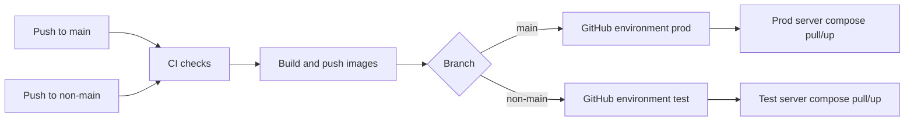

# План внедрения CI/CD деплоя

## Принятые допущения

- CI/CD платформа: GitHub Actions, так как репозиторий подключен к GitHub.
- Registry: GHCR или другой Docker Registry, доступный из GitHub Actions и с серверов.
- Деплой: SSH на сервер, `docker compose pull && docker compose up -d`.
- `main` деплоится в `prod`, все остальные ветки деплоят один общий `test`-стенд и перезаписывают его последним успешным билдом.
- Основа текущего деплоя уже есть: [Makefile](Makefile), [docker-compose.yml](docker-compose.yml), [docker-compose.staging.yml](docker-compose.staging.yml), [backend/Dockerfile](backend/Dockerfile), [frontend/Dockerfile](frontend/Dockerfile), [backup-service/Dockerfile](backup-service/Dockerfile).

## План изменений в репозитории

1. Нормализовать compose для CI/CD.
  - Добавить production compose override, например [docker-compose.prod.yml](docker-compose.prod.yml), или адаптировать текущий [docker-compose.yml](docker-compose.yml) под image-based deploy.
  - Оставить [docker-compose.staging.yml](docker-compose.staging.yml) для test, но заменить `build:` на `image:` в deploy-вариантах, чтобы сервер не собирал код сам.
  - Передавать теги образов через `.env`: `BACKEND_IMAGE`, `FRONTEND_IMAGE`, `BACKUP_IMAGE`, `IMAGE_TAG`.
2. Добавить единые команды в [Makefile](Makefile).
  - `test`: backend Go tests, backup-service Go tests, frontend lint/build.
  - `ci`: полный набор быстрых проверок.
  - `deploy-prod` и `deploy-test`: pull/up через нужный compose-файл и env.
  - Текущая база уже содержит полезные targets: `lint`, `stage-up`, `stage-down`, `stage-reset`.
3. Добавить GitHub Actions workflow.
  - Новый файл [.github/workflows/ci-cd.yml](.github/workflows/ci-cd.yml).
  - На каждый push и PR запускать проверки:
    - `cd backend && go test ./...`
    - `cd backup-service && go test ./...`
    - `cd frontend && npm ci && npm run lint && npm run build`
    - `make lint` или прямой `golangci-lint run ./...`
  - Для `push` после успешного CI собирать Docker images для backend, frontend и backup-service.
  - Теги: `sha-<commit>`, `branch-<safe-branch>`, `prod-latest` для `main`, `test-latest` для non-main.
4. Добавить deploy jobs с GitHub Environments.
  - `deploy_prod`: условие `github.ref == 'refs/heads/main'`, environment `prod`.
  - `deploy_test`: условие `github.ref != 'refs/heads/main'`, environment `test`.
  - Использовать environment secrets, чтобы prod/test имели разные SSH-ключи, env-файлы и адреса серверов.
  - Для `prod` включить protection rule/manual approval в GitHub Environment.
5. Добавить серверный deploy-скрипт.
  - Например [scripts/deploy-compose.sh](scripts/deploy-compose.sh).
  - Скрипт принимает `env` и `image_tag`, логинится в registry, обновляет `.env`, выполняет `docker compose pull`, `docker compose up -d`, затем healthcheck.
  - Для test использовать отдельный compose project name, например `knowledgeos-test`; для prod `knowledgeos-prod`.
6. Добавить smoke/e2e этапы.
  - Минимальный smoke после деплоя: `GET /` и `GET /api/.../health`, если health endpoint есть или будет добавлен.
  - Playwright e2e из [frontend/playwright.config.ts](frontend/playwright.config.ts) запускать либо на test после deploy, либо отдельным nightly/manual workflow, чтобы не блокировать каждый feature push.
7. Добавить документацию.
  - Новый документ [docs/DEPLOYMENT.md](docs/DEPLOYMENT.md): окружения, ветки, секреты, rollback, ручной деплой, структура серверных директорий.
  - Обновить [.env.example](.env.example), если появятся новые переменные для image-based deploy.

## Что нужно подготовить тебе

1. Доступы и серверы.
  - Два сервера или два изолированных окружения: `prod` и `test`.
  - IP/hostnames, SSH user, SSH private key для CI, разрешённый доступ по SSH из GitHub Actions.
  - Установить на серверах Docker Engine и Docker Compose plugin.
  - Создать директории, например `/opt/knowledgeos/prod` и `/opt/knowledgeos/test`.
2. Домены и сеть.
  - Production домен, например `app.example.com`.
  - Test домен, например `test.example.com`.
  - DNS A/AAAA записи на нужные серверы.
  - Открытые порты `80/443`; внутренний `8080/8081` лучше не публиковать наружу без reverse proxy.
3. TLS.
  - Выбрать способ TLS: внешний reverse proxy, nginx на сервере, Caddy/Traefik или certbot.
  - Передать путь к сертификатам или подтвердить, что TLS терминируется вне контейнеров.
  - Сейчас [nginx/nginx.conf](nginx/nginx.conf) использует HTTP-конфигурацию; prod TLS нужно оформить отдельно.
4. GitHub secrets и environments.
  - Создать GitHub Environments: `prod`, `test`.
  - Для каждого окружения добавить secrets: `SSH_HOST`, `SSH_USER`, `SSH_PRIVATE_KEY`, `SSH_PORT`, `DEPLOY_PATH`, `APP_ENV_FILE` или отдельные env secrets.
  - Для registry: `REGISTRY_USERNAME`, `REGISTRY_TOKEN`, либо использовать `GITHUB_TOKEN` для GHCR.
  - Включить approval для `prod` environment.
5. Application secrets для каждого окружения.
  - `JWT_SECRET`.
  - `SUPERADMIN_EMAIL`, `SUPERADMIN_PASSWORD`.
  - `POSTGRES_USER`, `POSTGRES_PASSWORD`, `POSTGRES_DB`.
  - `SECRETS_ENCRYPTION_KEY`.
  - `YANDEX_FOLDER_ID`, `YANDEX_API_KEY`, при необходимости модели/endpoint.
  - `BACKUP_API_KEY`, если включаем backup snapshot endpoint.
  - `GITHUB_REPO_URL`, `GITHUB_TOKEN`, `GITHUB_BRANCH`, если включаем backup-service.
  - `CLOUD_API_URL`, `CLOUD_API_KEY`, если нужен sync-agent.
6. Данные и политика БД.
  - Решить, где живёт Postgres: контейнер на том же сервере, отдельная VM или managed Postgres.
  - Подготовить volume/backup policy для prod.
  - Решить, переносим ли текущие данные в prod/test.
  - Для test определить поведение: сохранять БД между деплоями или сбрасывать/сидировать.
7. Rollback и эксплуатация.
  - Согласовать retention Docker images в registry.
  - Согласовать способ rollback: redeploy предыдущего `sha-<commit>`.
  - Согласовать логирование и мониторинг: хотя бы `docker compose logs`, disk alerts, healthcheck endpoint.

## Критичные риски

- Все non-main ветки на один test-стенд могут конфликтовать: последний успешный push победит предыдущий.
- Секреты нельзя хранить в `.env` внутри репозитория; только GitHub Environment Secrets или серверный secret store.
- Если `prod` и `test` на одном сервере, нужно строго разделить compose project names, volumes, ports, env-файлы и домены.
- Миграции сейчас выполняются при старте backend; для prod желательно добавить отдельный controlled migration step или хотя бы rollback-процедуру перед включением автодеплоя.

