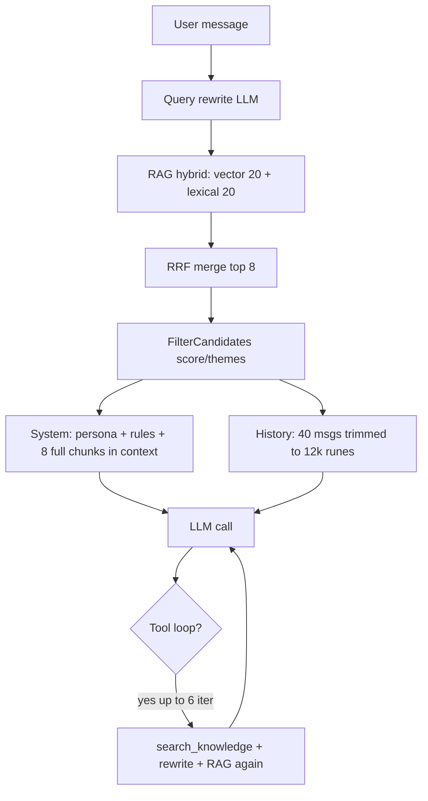

# План оптимизации контекста для LLM

## Исходные данные

**Живые логи в этой сессии недоступны** (Docker не запущен). Анализ выполнен по коду и документации. Для реального замера перед изменениями:

```bash
BOT_CHAT_DEBUG_LOG=true LOG_LEVEL=debug docker compose up app
docker compose logs app | jq 'select(.message | test("chat|yandex|retriever"))'
```

| Режим | Что видно |
|-------|-----------|
| `chat turn completed` (всегда) | `source_count`, `tokens`, `used_tools`, guardrails |
| `LOG_LEVEL=debug` | `prompt_tokens` / `completion_tokens` от Yandex |
| `BOT_CHAT_DEBUG_LOG=true` | полный `system_prompt` + `llm_messages` (PII!) |

Код: [`chat_llm_log.go`](backend/internal/service/chat_llm_log.go), [`chat.go`](backend/internal/service/chat.go) (`logTurn`).

---

## Текущий поток контекста



**На каждый ход пользователя минимум 1–2 LLM-вызова** (rewrite + ответ), при tool-loop — до 7+ (rewrite на каждый `search_knowledge` + итерации).

---

## Что уходит в LLM (разбор по блокам)

### 1. System prompt — [`buildSystemPrompt`](backend/internal/service/chat.go)

Содержит:
- персону (`persona_name`, `persona_tone`, `persona_rules`)
- ~6 строк жёстких инструкций (grounding, anti-injection, формат цитат)
- блок `<context>` с **полным текстом** до 8 чанков (`src.Content`, не snippet)

Оценка размера: фиксированная часть ~400–800 символов + `persona_rules` + **до ~9600 символов** (8 × `targetArticleChunk` 1200 из [`chunker.go`](backend/internal/rag/indexer/chunker.go)).

### 2. RAG prefetch — всегда, до основного вызова

```go
retrieveResult, _ := s.retriever.Search(..., HybridTopK: chatContextMaxChunks, Rewrite: true)
```

- `chatContextMaxChunks = 8` — хардкод в [`chat.go`](backend/internal/service/chat.go)
- `Rewrite: true` — **отдельный LLM-вызов** на каждый поиск ([`retriever.rewriteQuery`](backend/internal/service/retriever.go))
- Векторная ветка: top `RAG_VECTOR_TOP_K=20`, полный `content` из БД
- Лексическая ветка: только `LEFT(content, 240)` как snippet — **несимметрично** с вектором

### 3. История чата — [`trimChatHistory`](backend/internal/service/chat.go)

- Из БД: последние **40** сообщений (`chatHistoryLimit`)
- В промпт: обрезка с конца по **12000 рун** суммарного `Content`
- Корректно сохраняет пары assistant↔tool (orphan tool messages отбрасываются)
- **Не фильтрует по релевантности** — старые реплики о другой теме остаются, пока влезают в лимит

### 4. Tool-loop — [`runToolLoop`](backend/internal/service/chat.go)

При наличии tools (всегда зарегистрированы в [`main.go`](backend/cmd/api/main.go)):
- Prefetch **8 чанков уже в system prompt**
- Модель может вызвать `search_knowledge` → ещё RAG + rewrite + до 10 чанков в tool-result
- Каждая итерация **переотправляет весь накопленный** `llmMessages` (system + history + tool calls/results)
- До **6 итераций** (`maxToolIterations = 5`)

`get_pricing`: до 50 позиций JSON; `get_service_info`: полная сущность по UUID.

### 5. Служебный rewrite — скрытый расход

Вызывается при **каждом** `RetrieverService.Search` с `Rewrite: true`:
- prefetch в `generate`
- каждый `search_knowledge` в tool-loop

Промпт: короткий system + user query, `max_tokens: 64`. Дешёвый, но лишний на однозначных запросах.

---

## Что работает нормально (не трогать без причины)

| Компонент | Почему ок |
|-----------|-----------|
| **Guardrails до LLM** | `FilterCandidates`, отказ без контекста без tools — 0 токенов на пустой KB |
| **Hybrid RAG (vector + lexical + RRF)** | Хорошая база релевантности |
| **Chunking статей** | 1200/350 символов — разумный компромисс |
| **Пост-проверка цитат** | `fabricated_citation` / `prompt_leak` — защита без доп. LLM |
| **Pairing tool messages в истории** | Не ломает контекст при обрезке |
| **PII-safe логи по умолчанию** | `logTurn` без тел; `x-data-logging-enabled: false` |
| **Лимит tool-итераций** | Гарантированное завершение |
| **Настройки `min_retrieval_score`, `allowed_theme_ids`** | Уже есть per-tenant фильтрация мусора |

Документация: [`BOT-GUARDRAILS.md`](docs/BOT-GUARDRAILS.md), [`BOT-TOOLS.md`](docs/BOT-TOOLS.md).

---

## Что лишнее / неэффективно

### Критичное (большой эффект на токены)

1. **Дублирование prefetch + tools**  
   При включённом tool-loop в system prompt кладутся 8 чанков, а модель почти всегда может (и часто будет) вызывать `search_knowledge` с тем же запросом → **двойной RAG + двойной rewrite + дубли чанков** в накопленном контексте.

2. **Полный content в prefetch, не snippet**  
   В `<context>` идёт весь чанк (~1200 символов). Для ответа часто хватает заголовка + 2–3 предложений; полный текст оправдан только после `get_service_info`.

3. **Нет бюджета на input tokens**  
   Есть только `chatHistoryMaxRunes=12000` и `chatContextMaxChunks=8`. Суммарный prompt может превысить окно модели; нет предупреждений в логах.

4. **Tool-loop переотправляет весь контекст**  
   На итерации 3–5 в запросе: system (8 чанков) + история + все предыдущие tool JSON. Основной источник роста `prompt_tokens`.

### Среднее

5. **Rewrite на каждый поиск** — лишний LLM-вызов для коротких/самодостаточных запросов («цена импланта», «режим работы»).

6. **Инструкция «перечисли источники после ответа»** в system prompt — раздувает **completion** (цитаты уже валидируются пост-проверкой; UI может брать `sources` из API).

7. **История без семантической фильтрации** — 12k рун старых реплик конкурируют с актуальным RAG-контекстом.

8. **`enabled_modules` не влияет на контекст** — поле в [`bot_settings`](backend/internal/domain/bot.go) сохраняется, но tools и prefetch не отключаются.

### Мелкое

9. **Лексический поиск отдаёт 240-символьный snippet**, векторный — full content → при RRF merge несогласованный размер чанков.

10. **Нет метрик размера контекста в `logTurn`** — только суммарный `tokens` после факта; нельзя быстро увидеть «что раздуло prompt» без `BOT_CHAT_DEBUG_LOG`.

---

## Что настроить уже сейчас (без кода)

| Настройка | Где | Рекомендация |
|-----------|-----|--------------|
| `min_retrieval_score` | Admin → bot settings / API | Начать с `0.01–0.05` — отсечь слабые чанки из `<context>` |
| `allowed_theme_ids` | bot settings | Ограничить домен, если бот отвечает по одной теме |
| `RAG_HYBRID_TOP_K` | `.env` | Снизить до 5–6, если prefetch остаётся |
| `RAG_VECTOR_TOP_K` | `.env` | 15 вместо 20 — меньше шума до RRF |
| `max_tokens` | bot settings | Только completion; не влияет на input |
| `BOT_CHAT_DEBUG_LOG` | `.env` | Включить на staging, прогнать 10–20 типовых вопросов, замерить размер `system_prompt` |
| `LOG_LEVEL=debug` | `.env` | Смотреть `prompt_tokens` по фазам (`single` vs `tool_loop_N`) |

---

## План улучшений (по приоритету)

### Фаза 0 — Наблюдаемость (1–2 дня)

Добавить в [`logTurn`](backend/internal/service/chat.go) и debug-лог **без PII**:

```
context_chunks, context_chars, history_messages, history_runes,
system_prompt_chars, tool_result_chars, llm_phase, prompt_tokens, completion_tokens
```

Опционально: хелпер `estimateContextSize(messages []llm.Message)` — считает руны по ролям.

**Цель:** видеть в обычных логах, что раздувает prompt, без полного дампа.

### Фаза 1 — Быстрые победы (низкий риск)

**1.1. Стратегия prefetch при tools**

В [`generate`](backend/internal/service/chat.go): если `hasTools == true`:
- **Вариант A (рекомендуется):** prefetch `HybridTopK: 0–2` (только «якорные» чанки) или только snippet-режим; основной поиск — через `search_knowledge`
- **Вариант B:** prefetch 8 чанков, но **отключить tools** для простых сценариев (playground без tools)

**1.2. Snippet в prefetch, full — по запросу**

В `buildSystemPrompt` для prefetch использовать `Snippet` (или первые N рун `Content`), оставив `get_service_info` для полного текста. Константа `chatContextSnippetRunes` (~400–600).

**1.3. Условный rewrite**

В [`retriever.go`](backend/internal/service/retriever.go): пропускать rewrite если:
- запрос > N слов и не содержит местоимений/«это»/«там»
- или это follow-up с явной сущностью из последнего assistant message

Флаг `Rewrite` оставить, но по умолчанию эвристика `shouldRewrite(query, history)`.

**1.4. Вынести лимиты в конфиг**

Заменить хардкод `chatContextMaxChunks`, `chatHistoryMaxRunes`, `chatHistoryLimit` на:
- env defaults + опционально поля в `bot_settings` (например `context_max_chunks`, `history_max_runes`)

### Фаза 2 — Умный отбор контекста (средний риск)

**2.1. MMR / diversity при отборе 8 чанков**

После RRF — отбрасывать чанки с высоким overlap (одна статья, соседние chunk_idx). Файл: [`mergeRRF`](backend/internal/service/retriever.go) или новый `selectDiverse(candidates, k)`.

**2.2. Relevance-aware history**

Перед `trimChatHistory`:
- всегда сохранять последние 2–4 реплики
- старше — включать только если `Content` пересекается с текущим query (лексически) или содержит cited source_id из последнего ответа

**2.3. Input token budget**

Перед отправкой в LLM:
```go
const maxInputRunes = 28000 // под модель
// урезать: сначала history (кроме last N), потом context chunks с низким score
```

**2.4. Дедупликация sources в tool-loop**

В [`runToolLoop`](backend/internal/service/chat.go): не добавлять в `llmMessages` tool-result, если `source_id` уже есть в prefetch/collected (или отдавать только `{source_id, title}` без `content`).

### Фаза 3 — Архитектурные улучшения (по необходимости)

**3.1. Режимы бота в `enabled_modules`**

```json
{"rag_prefetch": true, "tools": true, "query_rewrite": false}
```

Wire в [`generate`](backend/internal/service/chat.go) и [`tools/registry`](backend/internal/chat/tools/registry.go).

**3.2. Сжатие system prompt**

- Вынести статичные правила в короткий шаблон (меньше повторов)
- Цитаты — в structured output / поле `cited_source_ids` (уже есть в БД), убрать требование перечислять в тексте ответа

**3.3. Суммаризация длинных сессий**

При `history_runes > threshold` — один служебный вызов LLM «summary of conversation so far» (только при превышении бюджета), заменить старые реплики одним system/user summary block.

**3.4. Eval с метриками токенов**

Расширить [`cmd/chat-eval`](backend/cmd/chat-eval/main.go): средний `prompt_tokens`, `context_chars`, regression при смене стратегии контекста.

---

## Ожидаемый эффект

| Изменение | Экономия prompt tokens (оценка) |
|-----------|-----------------------------------|
| Snippet prefetch вместо full | 40–60% блока `<context>` |
| Prefetch 0–2 при tools | 60–80% дублирования RAG |
| Условный rewrite | −1 LLM call на ~50% запросов |
| MMR + min_retrieval_score | 10–30% шумных чанков |
| History relevance filter | 20–40% на длинных сессиях |
| Дедуп tool results | сильно на итерациях 2+ tool-loop |

---

## Риски и как их снизить

- **Меньше контекста → хуже grounding:** держать `require_citations` / eval harness; A/B на staging с `BOT_CHAT_DEBUG_LOG`
- **Snippet вместо full:** обязать модель вызывать `get_service_info` при нехватке данных (уже в system prompt)
- **Отключение prefetch при tools:** первый ответ может стать медленнее (+1 tool round-trip) — компенсируется меньшим prompt

---

## Рекомендуемый порядок работ

1. Фаза 0 — метрики в логах + прогон 20 вопросов со `BOT_CHAT_DEBUG_LOG`
2. Фаза 1.1 + 1.2 — prefetch snippet + меньше чанков при tools
3. Фаза 1.3 — условный rewrite
4. Настроить `min_retrieval_score` на реальных данных
5. Фаза 2 по результатам метрик (если `prompt_tokens` всё ещё высокий на tool-loop)
