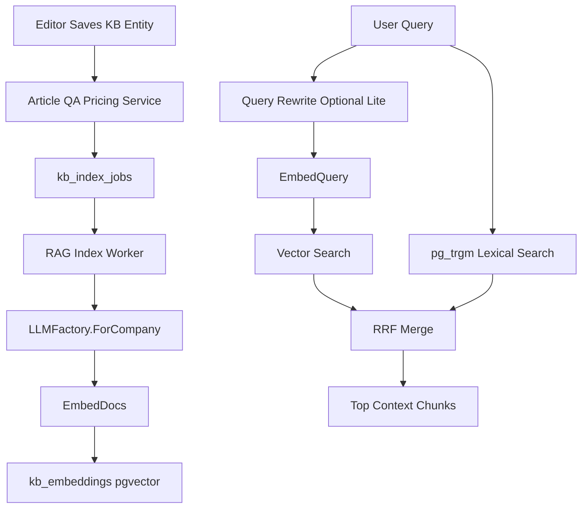

# План Б2: RAG-Ретривер И Гибридный Поиск

## Цель Б2

Реализовать backend-фундамент RAG для «Текстовой линзы»: хранение эмбеддингов базы знаний, первичную и инкрементальную индексацию `Article` / `QAPair` / `PricingNode`, векторный поиск через pgvector, лексическую ветку на базе существующего `pg_trgm`-поиска и объединение результатов через Reciprocal Rank Fusion.

Б2 опирается на уже завершённый Б1 из [PLAN/B1.MD](PLAN/B1.MD): `llm.Embedder`, `llm.Provider`, Yandex `EmbedDocs` / `EmbedQuery`, `LLMFactory.ForCompany`, tenant secrets и bot settings уже есть. Frontend-форма настроек бота в Б1 не реализована, но для Б2 это не блокер: нужен backend-контур индексации и retriever.

## Что Используем Из Б1

Ключевой контракт эмбеддингов уже есть в [backend/internal/llm/types.go](backend/internal/llm/types.go):

```17:25:backend/internal/llm/types.go
type Provider interface {
	Chat(ctx context.Context, req ChatRequest) (*ChatResponse, error)
	ChatStream(ctx context.Context, req ChatRequest) (<-chan StreamChunk, error)
}

type Embedder interface {
	EmbedDocs(ctx context.Context, texts []string) ([][]float32, error)
	EmbedQuery(ctx context.Context, text string) ([]float32, error)
}
```

Tenant-specific provider/embedder собирается через [backend/internal/service/llm_factory.go](backend/internal/service/llm_factory.go):

```37:60:backend/internal/service/llm_factory.go
func (f *LLMFactory) ForCompany(ctx context.Context, companyID uuid.UUID) (llm.Provider, llm.Embedder, error) {
	settings, err := f.settings.Get(ctx, companyID)
	if err != nil {
		return nil, nil, err
	}
	// ... existing code ...
	return client, client, nil
}
```

В [backend/cmd/api/main.go](backend/cmd/api/main.go) factory сейчас создаётся и выбрасывается в `_`; в Б2 её нужно сохранить в переменную и передать в `RAGIndexerService` / `RetrieverService`.

## Целевая Схема Потока




## Этап 1. Сверка Технических Деталей Перед Кодом

Перед реализацией нужно быстро проверить актуальную документацию pgvector и Yandex embeddings:

- Подтвердить доступную версию pgvector в docker-образе Postgres и поддержку HNSW для `vector_cosine_ops`.
- Использовать рекомендованные Yandex Cloud Embeddings v2: `emb://b1gi8ce8tfch6gph82sk/text-embeddings-v2-doc/latest` для индекса и `emb://b1gi8ce8tfch6gph82sk/text-embeddings-v2-query/latest` для запросов. По текущему плану используем `vector(256)`, а `model` и `dim` храним рядом с вектором.
- Подтвердить лимиты batch embeddings и максимальную длину входа, чтобы зафиксировать размер чанков и batch size worker-а.
- Проверить, нужен ли переход docker-compose на `pgvector/pgvector:pg16`; текущий план Б2 должен включить это, если стандартный `postgres:16` не содержит extension `vector`.

## Этап 2. Миграции И Схема Данных

Добавить [backend/migrations/013_pgvector.sql](backend/migrations/013_pgvector.sql):

- `CREATE EXTENSION IF NOT EXISTS vector`.
- Таблица `kb_embeddings`:
  - `id UUID PRIMARY KEY DEFAULT gen_random_uuid()`.
  - `company_id UUID NOT NULL REFERENCES companies(id) ON DELETE CASCADE`.
  - `entity_type TEXT NOT NULL CHECK (entity_type IN ('article','qa','pricing'))`.
  - `entity_id UUID NOT NULL`.
  - `chunk_idx INT NOT NULL`.
  - `theme_id UUID NULL`, чтобы фильтровать QA по теме и позже расширить фильтры.
  - `title TEXT NOT NULL DEFAULT ''`.
  - `content TEXT NOT NULL` — текст, который попадёт в RAG-контекст.
  - `content_hash TEXT NOT NULL` — пропуск неизменённых чанков.
  - `embedding vector(256) NOT NULL`.
  - `model TEXT NOT NULL`.
  - `dim INT NOT NULL DEFAULT 256`.
  - `created_at`, `updated_at`.
  - `UNIQUE(company_id, entity_type, entity_id, chunk_idx)`.
- Индексы:
  - HNSW: `USING hnsw (embedding vector_cosine_ops)`.
  - B-tree: `(company_id, entity_type, entity_id)`, `(company_id, theme_id)`, `(company_id, entity_type)`.
- Таблица `kb_index_jobs` для durable outbox:
  - `id UUID PRIMARY KEY DEFAULT gen_random_uuid()`.
  - `company_id UUID NOT NULL`.
  - `entity_type TEXT NOT NULL`.
  - `entity_id UUID NOT NULL`.
  - `operation TEXT NOT NULL CHECK (operation IN ('upsert','delete'))`.
  - `status TEXT NOT NULL DEFAULT 'pending' CHECK (status IN ('pending','processing','done','failed'))`.
  - `attempts INT NOT NULL DEFAULT 0`.
  - `last_error TEXT`.
  - `available_at TIMESTAMPTZ NOT NULL DEFAULT now()`.
  - timestamps.
  - индекс `(status, available_at)` и уникальность активной pending-задачи по `company_id + entity_type + entity_id + operation`, если это удобно реализовать без усложнения.

Почему нужна `kb_index_jobs`: вызов embeddings сетевой и потенциально дорогой, поэтому нельзя блокировать `Create/Update/Delete` статей, QA и прайса.

## Этап 3. Domain И Store-Слой

Расширить [backend/internal/domain/repository.go](backend/internal/domain/repository.go):

- Добавить типы `KBEntityType`, `KBEmbedding`, `KBIndexJob`, `RAGChunk`, `RetrieveRequest`, `RetrieveResult`.
- Добавить интерфейсы:
  - `KBEmbeddingRepository` для `UpsertChunks`, `DeleteEntity`, `VectorSearch`, `ListByEntity`, `CountByCompany`.
  - `KBIndexJobRepository` для `Enqueue`, `ClaimPending`, `MarkDone`, `MarkFailed`.
  - `Retriever` / `RetrieverRepository` для backend-поиска, который нужен Б3.

Добавить stores:

- [backend/internal/store/kb_embedding.go](backend/internal/store/kb_embedding.go): SQL/GORM операции по `kb_embeddings`, включая raw SQL для pgvector similarity.
- [backend/internal/store/kb_index_job.go](backend/internal/store/kb_index_job.go): durable queue с `FOR UPDATE SKIP LOCKED`, чтобы несколько worker-ов не взяли одну задачу.

Все методы должны принимать `companyID uuid.UUID`; ни одна операция поиска или индексации не должна работать без tenant filter.

## Этап 4. Чанкинг По Типам Сущностей

Добавить пакет [backend/internal/rag/indexer](backend/internal/rag/indexer):

- `Chunker` с методами `ChunksForArticle`, `ChunksForQA`, `ChunksForPricing`.
- `Article`: резать по заголовкам/абзацам, целевой размер примерно 800-1500 символов, overlap около 15%, без разрыва предложения там, где это просто реализовать.
- `QAPair`: эмбеддить вопрос или `question + answer`; в `content` для RAG отдавать полный ответ вместе с вопросом. Первичный вариант: embedding text = question, context content = question + answer.
- `PricingNode`: рендерить в естественный текст: название услуги, цена, тип узла, при возможности родительский путь.
- Для каждого чанка считать `content_hash` по нормализованному тексту.
- Для delete-операций удалять все `kb_embeddings` по `company_id + entity_type + entity_id`.

Важно: текущие сущности находятся в [backend/internal/domain/article.go](backend/internal/domain/article.go), [backend/internal/domain/qa.go](backend/internal/domain/qa.go), [backend/internal/domain/pricing.go](backend/internal/domain/pricing.go). `PricingNode` сейчас не участвует в общем search, поэтому Б2 должен добавить его как полноценный источник RAG.

## Этап 5. Инкрементальная Индексация

Подключить enqueue-задачи после успешных изменений в сервисах:

- [backend/internal/service/article.go](backend/internal/service/article.go): `Create`, `Update` -> `upsert`; `Delete` -> `delete`.
- [backend/internal/service/qa.go](backend/internal/service/qa.go): `Create`, `Update`, `ReviewAIAnswer` -> `upsert`; `Delete` -> `delete`.
- [backend/internal/service/pricing.go](backend/internal/service/pricing.go): `Create`, `Update`, `Move` -> `upsert`; `Delete` -> `delete`.

Чтобы не разнести сигнатуры слишком широко, сделать индексатор зависимостью сервисов опционально через интерфейс, например `KnowledgeIndexScheduler`. В тестах можно использовать no-op/mock.

Отдельно зафиксировать риск: `ApplyRemote`, import и sync могут обходить обычные service-методы. Для Б2 минимум нужен ручной/админский `ReindexCompany`; полноценное enqueue при import/sync можно включить в тот же блок, если это не раздувает scope.

## Этап 6. Worker Индексации

Добавить `RAGIndexerService` в [backend/internal/service](backend/internal/service):

- На старте приложения запускать background worker с контекстом процесса.
- Worker claim-ит пачку pending jobs из `kb_index_jobs`.
- Для `delete` вызывает `KBEmbeddingRepository.DeleteEntity`.
- Для `upsert` загружает актуальную сущность через существующие repositories, строит chunks, пропускает неизменённые по `content_hash`, вызывает `LLMFactory.ForCompany`, затем `EmbedDocs`.
- При отсутствии LLM secret или ошибке Yandex job переходит в `failed` с `last_error`, но CRUD базы знаний остаётся успешным.
- Ретраи: exponential backoff через `available_at`, лимит attempts, например 5.
- Batch size и interval сделать config/env с безопасными дефолтами.

Также добавить метод первичной индексации:

- `ReindexCompany(ctx, companyID)` — удаляет/переиспользует текущие embeddings и enqueue-ит все активные `Article`, `QAPair`, `PricingNode`.
- Опциональный admin endpoint `POST /api/v1/admin/bot/rag/reindex` и `GET /api/v1/admin/bot/rag/index-status` под `admin + superadmin`, чтобы можно было принять Б2 без ручного SQL.

## Этап 7. Гибридный Retriever И RRF

Добавить пакет [backend/internal/rag/retriever](backend/internal/rag/retriever):

- `RetrieverService.Search(ctx, companyID, req)`.
- Query rewrite через `llm.Provider.Chat`:
  - дешёвый служебный prompt, temperature `0`, небольшой `max_tokens`.
  - если rewrite падает, возвращает пусто или таймаутится — искать по исходной фразе.
  - в Б2 история диалога ещё не реализована, поэтому rewrite принимает только текущий query; поддержку истории оставить для Б3.
- `EmbedQuery` для векторной ветки.
- Vector branch: top-N по cosine distance из `kb_embeddings`, всегда `WHERE company_id = ?`, optional filters `entity_type`, `theme_id`.
- Lexical branch: переиспользовать и расширить [backend/internal/store/search.go](backend/internal/store/search.go), где сейчас есть `qa` и `article` на `word_similarity`; добавить `pricing` и привести результат к единому `RAGCandidate`.
- RRF merge:
  - `score = sum(1 / (60 + rank))`.
  - дедупликация по `entity_type + entity_id + chunk_idx` для vector chunks и по `entity_type + entity_id` для lexical results.
  - итоговый top-k 5-8 для будущего контекста Б3.
- Возвращать `source_id`, `entity_type`, `entity_id`, `chunk_idx`, `title`, `content/snippet`, `score`, `score_parts`.

Существующий `/api/v1/search` можно оставить как UI-search. Для Б2 лучше добавить внутренний service API retriever и, если нужен ручной тест, отдельный admin/debug endpoint под JWT: `POST /api/v1/admin/bot/rag/search`. Публичный Chat API появится в Б3.

## Этап 8. Wiring В main.go И Router

Изменить [backend/cmd/api/main.go](backend/cmd/api/main.go):

- Создать `llmFactory := service.NewLLMFactory(...)` вместо `_ = ...`.
- Создать `kbEmbeddingStore`, `kbIndexJobStore`.
- Создать `ragIndexerSvc`, `retrieverSvc`.
- Передать scheduler в `ArticleService`, `QAService`, `PricingService`.
- Запустить worker после bootstrap и до `ListenAndServe`.
- Добавить handler для admin RAG endpoints, если они включаются в Б2.

Изменить [backend/internal/handler/router.go](backend/internal/handler/router.go):

- Добавить admin routes под существующий `RequireRole(domain.RoleAdmin, domain.RoleSuperadmin)`.
- Не добавлять публичные маршруты Б3 раньше времени.

## Этап 9. Docker И Config

Обновить:

- [.env.example](.env.example): настройки RAG worker, batch size, retry interval, optional top-k defaults.
- [docker-compose.yml](docker-compose.yml) и [docker-compose.staging.yml](docker-compose.staging.yml): если нужно, заменить Postgres image на `pgvector/pgvector:pg16` или добавить совместимый способ установки extension.
- [backend/internal/config/config.go](backend/internal/config/config.go): `RAGWorkerEnabled`, `RAGWorkerBatchSize`, `RAGWorkerPollIntervalSeconds`, `RAGIndexMaxAttempts`, `RAGVectorTopK`, `RAGHybridTopK`.

## Этап 10. Тестирование

Unit tests:

- `Chunker`: QA, article paragraph splitting, pricing render, stable `content_hash`.
- `RRF`: корректное объединение vector/lexical рангов, дедупликация, стабильная сортировка.
- `RetrieverService`: fallback на исходный query при ошибке rewrite, tenant filter прокидывается, пустой query отклоняется.
- `RAGIndexerService`: delete удаляет embeddings, unchanged chunks не переэмбеддятся, failed jobs получают attempts/last_error.

Store/integration tests:

- Миграция `013_pgvector.sql` применяется на чистой БД.
- `kb_embeddings` запрещает дубликаты chunk index внутри entity.
- Vector search не возвращает данные другой компании.
- Delete entity удаляет только embeddings нужного tenant.
- `kb_index_jobs` claim через `SKIP LOCKED` не отдаёт одну job дважды.

API/service tests:

- `Create/Update/Delete` article/qa/pricing enqueue-ят правильные jobs.
- `ReviewAIAnswer` после принятия/редактирования QA enqueue-ит reindex.
- Admin reindex endpoint доступен `admin/superadmin`, недоступен `viewer/editor`.
- Admin search/debug endpoint не раскрывает данные другого tenant.

Финальная проверка:

- `cd backend && go test ./...`.
- `ReadLints` по изменённым Go-файлам.
- Ручной smoke: создать QA/Article/Pricing, запустить reindex, проверить hybrid search по разговорной формулировке и по точному названию услуги.

## Критерии Приёмки Б2

- Pgvector включён миграцией, embeddings хранятся tenant-scoped и содержат `model`, `dim`, `content_hash`.
- Первичная индексация существующей базы знаний запускается без ручного SQL.
- Новые/изменённые/удалённые `Article`, `QAPair`, `PricingNode` попадают в индекс асинхронно.
- `EmbedDocs` используется для документов, `EmbedQuery` для поискового запроса.
- Гибридный retriever объединяет vector и lexical результаты через RRF.
- Поиск всегда ограничен `company_id`; тесты доказывают отсутствие cross-tenant leakage.
- Прайс становится источником RAG наравне с QA и статьями.
- Ошибка Yandex/секрета не ломает CRUD базы знаний, а переводит index job в failed с понятной диагностикой.

## Риски И Решения

- `postgres:16` может не иметь pgvector: заранее проверить и при необходимости перейти на `pgvector/pgvector:pg16`.
- Асинхронная индексация даёт eventual consistency: для приёмки добавить `ReindexCompany` и index status.
- Import/sync могут обходить сервисные hooks: в Б2 минимум покрыть это через full reindex, затем при необходимости enqueue из import/sync.
- Неверная размерность embeddings приведёт к ошибкам вставки: хранить `dim`, но SQL column на Б2 фиксировать `vector(256)`; смену размерности оформить отдельной миграцией в будущем.
- Лексический поиск сейчас только `pg_trgm` и без `pricing`: расширить, но не ломать существующий `/api/v1/search` для UI.
- Query rewrite не должен быть единой точкой отказа: все ошибки rewrite ведут к поиску по исходному query.

