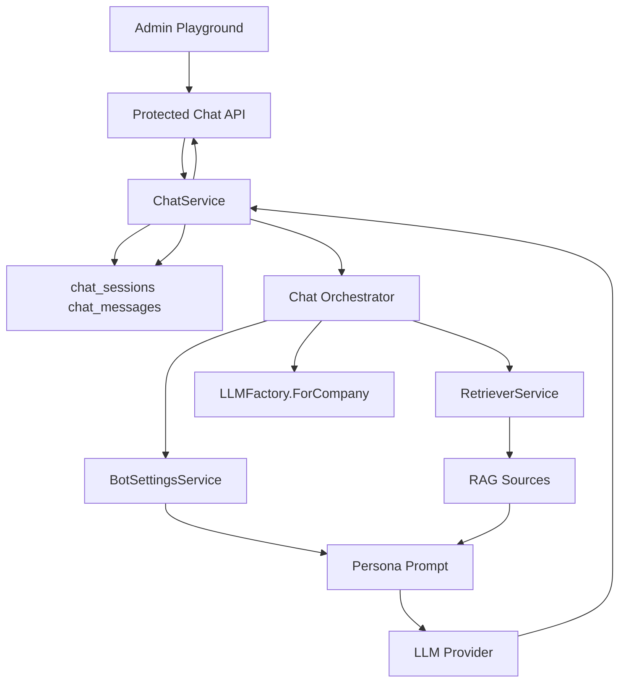

# План Б3: Ядро Чата «Текстовая Линза»

## Цель

Б3 должен превратить уже подготовленные Б1/Б2 в рабочий многоходовый чат: сохранять сессии и сообщения, поднимать tenant-specific LLM через `LLMFactory`, извлекать контекст через `RetrieverService`, собирать промпт с персоной из `bot_settings`, отдавать обычный и streaming-ответ, а во фронтенде дать внутренний playground для ручной приёмки.

Текущие опоры уже есть:

- [backend/internal/llm/types.go](backend/internal/llm/types.go): `Provider.Chat`, `Provider.ChatStream`, `Usage`, `ToolCall`.
- [backend/internal/service/llm_factory.go](backend/internal/service/llm_factory.go): tenant-specific provider/embedder.
- [backend/internal/service/retriever.go](backend/internal/service/retriever.go): hybrid RAG search с query rewrite, vector + lexical и RRF.
- [backend/internal/service/bot_settings.go](backend/internal/service/bot_settings.go): persona/model/temperature/max_tokens.
- [backend/internal/handler/router.go](backend/internal/handler/router.go): protected JWT + tenant routes и admin-группа для `/admin/bot/*`.

## Архитектурный Поток

## Backend План

1. Добавить миграцию [backend/migrations/014_chat.sql](backend/migrations/014_chat.sql).

- `chat_sessions`: `id`, `company_id`, `channel`, `external_chat_id`, `state`, `operator_id`, `title`, `last_message_at`, timestamps.
- `chat_messages`: `id`, `company_id`, `session_id`, `role`, `content`, `tool_calls JSONB`, `sources JSONB`, `tokens_prompt`, `tokens_completion`, timestamps.
- Constraints: роли `user/assistant/tool/operator`, состояния минимум `bot/closed`, канал минимум `playground/api` с запасом под каналы Б6.
- Индексы: `(company_id, last_message_at)`, `(company_id, channel, external_chat_id)`, `(session_id, created_at)`.

1. Добавить domain/store слой.

- Новый файл [backend/internal/domain/chat.go](backend/internal/domain/chat.go): `ChatSession`, `ChatMessage`, `ChatRole`, `ChatState`, `ChatSource`, request/response DTO и repository interfaces.
- Новый store [backend/internal/store/chat.go](backend/internal/store/chat.go): create/list/get session, append/list messages, update session metadata.
- Все операции строго tenant-scoped по `company_id`; `session_id` без `company_id` не используется.

1. Реализовать `ChatService` и orchestrator.

- Новый сервис [backend/internal/service/chat.go](backend/internal/service/chat.go): создание сессии, получение истории, отправка сообщения, streaming-отправка.
- Новый пакет или файл [backend/internal/service/chat_orchestrator.go](backend/internal/service/chat_orchestrator.go): pipeline `history -> retrieve -> prompt -> LLM -> persist`.
- Перед генерацией проверять `bot_settings.enabled`; если бот выключен или LLM secret не настроен, возвращать понятную 400/409 ошибку.
- Вызвать `RetrieverService.Search` с `Rewrite=true`, сохранить найденные `RAGCandidate` как `sources` в assistant message.
- Системный промпт собирать из `persona_name`, `persona_tone`, `persona_rules`; контекст RAG передавать как данные с явными `source_id`, не как инструкции.
- Историю ограничить простым бюджетом для Б3: последние N сообщений и максимум символов/примерная оценка токенов. Суммаризацию старой истории оставить для Б5/последующего улучшения, если не потребуется для приёмки.
- Tool-calls из `llm.ChatResponse` сохранить в message, но не строить полноценный tool loop: это граница Б4. Если модель вернула tool call в Б3, логировать/сохранять и отдавать graceful fallback.

1. Добавить HTTP handler и routes.

- Новый [backend/internal/handler/chat.go](backend/internal/handler/chat.go).
- Protected routes в [backend/internal/handler/router.go](backend/internal/handler/router.go), доступные минимум `viewer+` для playground:
  - `POST /api/v1/admin/bot/chat/sessions` — создать playground-сессию.
  - `GET /api/v1/admin/bot/chat/sessions` — список последних сессий для текущего tenant.
  - `GET /api/v1/admin/bot/chat/sessions/{id}` — session metadata + история.
  - `POST /api/v1/admin/bot/chat/sessions/{id}/messages` — обычный non-stream ответ.
  - `POST /api/v1/admin/bot/chat/sessions/{id}/messages/stream` — SSE поверх `text/event-stream`.
- Для streaming использовать `http.Flusher`: события `delta`, `sources`, `usage`, `message`, `error`, `done`.
- На завершении stream собрать полный assistant content и сохранить его вместе с sources/usage; user message сохранять до запуска LLM.

1. Подключить wiring.

- В [backend/cmd/api/main.go](backend/cmd/api/main.go): создать `ChatStore`, `ChatService`, `ChatHandler`, передать `RetrieverService`, `BotSettingsService`, `LLMFactory`.
- В [backend/internal/handler/router.go](backend/internal/handler/router.go): добавить поле `Chat *ChatHandler` в `Handlers` и routes рядом с bot/RAG routes.

## Frontend План

1. Добавить API и типы.

- [frontend/src/api/botChat.ts](frontend/src/api/botChat.ts): create/list/get/send и `streamMessage` через `fetch`, потому что нативный `EventSource` плохо подходит для protected POST с `Authorization` header.
- [frontend/src/types/models.ts](frontend/src/types/models.ts): `ChatSession`, `ChatMessage`, `ChatSource`, `ChatRole`.
- [frontend/src/lib/queryKeys.ts](frontend/src/lib/queryKeys.ts): ключи `botChat.sessions`, `botChat.detail`.

1. Добавить playground UI.

- Новая страница [frontend/src/pages/bot/BotPlaygroundPage.tsx](frontend/src/pages/bot/BotPlaygroundPage.tsx).
- Основной сценарий: создать/выбрать сессию, отправить сообщение, показывать streaming delta, после ответа показать источники с `title`, `entity_type`, `score` и фрагментом.
- Ошибки `bot disabled`, `LLM secret missing`, `RAG empty` отображать как нормальное состояние, не как падение интерфейса.

1. Подключить навигацию.

- [frontend/src/App.tsx](frontend/src/App.tsx): route `/bot/playground` под `ProtectedRoute minimumRole="viewer"` или `admin`, если нужно оставить playground только администраторам.
- [frontend/src/components/layout/AppSidebar.tsx](frontend/src/components/layout/AppSidebar.tsx): раздел «Бот» с пунктом «Плейграунд».

## Тестирование

Backend unit/service:

- `ChatStore` не возвращает сессии/сообщения другого tenant.
- `ChatService.CreateSession` создаёт session с channel `playground`.
- `SendMessage` сохраняет user message до генерации и assistant message после генерации.
- Orchestrator вызывает `RetrieverService` и кладёт `sources` в assistant message.
- При пустом RAG-контексте Б3 возвращает вежливый fallback; строгий guardrail и скоринг останутся в Б5.
- Streaming сохраняет тот же итоговый assistant message, который был отдан дельтами.

Backend API:

- `viewer+` или выбранная роль может создать сессию и отправить сообщение.
- `session_id` из другой компании возвращает 404/403.
- SSE endpoint выставляет `Content-Type: text/event-stream`, flush-ит delta и завершает `done`.
- Ошибки LLM/RAG возвращаются структурированно и не раскрывают секреты/сырые provider body.

Frontend:

- Playground создаёт сессию, отправляет сообщение, рендерит streaming delta.
- Источники ответа отображаются после завершения stream.
- При 401 сохраняется существующий auth flow; при 4xx от bot API показывается понятное сообщение.

Финальная проверка:

- `cd backend && go test ./...`.
- `cd frontend && npm run lint` и, если есть, `npm run build`.
- Ручной smoke: включить bot settings, задать LLM secret/env fallback, выполнить RAG reindex, задать вопрос по QA/Article/Pricing в playground, убедиться что история сохранена и ответ содержит источники.

## Критерии Приёмки Б3

- Через REST API можно создать сессию, отправить несколько сообщений и получить историю.
- Ответ строится через Б2 retriever и сохраняет источники в `chat_messages.sources`.
- Streaming отдаёт ответ по мере генерации и сохраняет финальный assistant message.
- Персона берётся из `bot_settings`, а модель/ключи из Б1 tenant configuration.
- Playground доступен во внутренней админке и показывает историю, текущий streaming-ответ и источники.

## Риски И Границы

- Полный tool-call цикл не входит в Б3; в Б3 нужно сохранить совместимость типов, но исполнение инструментов реализовать в Б4.
- Жёсткие guardrails, confidence scoring и eval harness относятся к Б5; в Б3 нужен минимальный fallback при пустом контексте, чтобы бот не отвечал совсем «из головы».
- Нативный `EventSource` неудобен с JWT, поэтому frontend streaming лучше делать через `fetch` + `ReadableStream` с SSE-форматом.
- Если Б2 index пустой или worker failed из-за LLM secret, playground должен явно показывать диагностируемую ошибку, а не выглядеть как сломанный чат.

