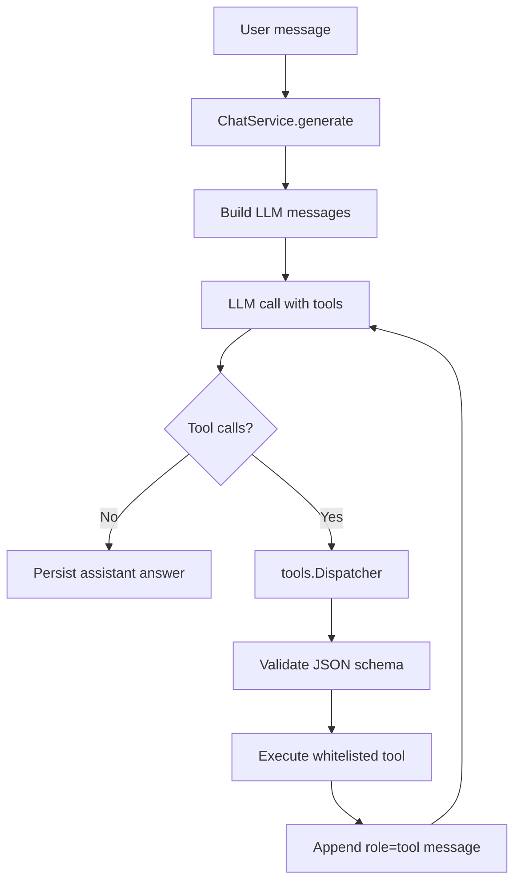

# План Б4: Фреймворк Вызова Инструментов

## Цель

Довести Б4 до критериев приёмки из [PLAN/PLAN.md](PLAN/PLAN.md): бот должен передавать LLM доступные инструменты, исполнять вызванные tool-calls, использовать результаты в финальном ответе и отклонять некорректные аргументы на этапе JSON-schema валидации.

Текущая база уже частично готова:

- [backend/internal/llm/types.go](backend/internal/llm/types.go) содержит `llm.Tool`, `llm.ToolCall`, `RoleTool`, `ChatRequest.Tools`.
- [backend/internal/llm/yandex/client.go](backend/internal/llm/yandex/client.go) уже сериализует tools и парсит tool-calls.
- [backend/internal/service/chat.go](backend/internal/service/chat.go) сохраняет `ToolCalls`, но пока возвращает заглушку, если модель запросила инструмент.
- [backend/internal/service/retriever.go](backend/internal/service/retriever.go), [backend/internal/service/pricing.go](backend/internal/service/pricing.go), [backend/internal/service/article.go](backend/internal/service/article.go), [backend/internal/service/qa.go](backend/internal/service/qa.go) дают backend-источники для первых tools.

## Архитектурное Решение

Оставить публичный Chat API без изменений и внедрить Б4 внутри текущего backend-цикла чата. Новый пакет [backend/internal/chat/tools](backend/internal/chat/tools) будет отвечать только за registry, schemas, validation и execution. [backend/internal/service/chat.go](backend/internal/service/chat.go) останется точкой orchestration для Б4, без крупного выноса в отдельный `internal/chat/orchestrator` на этом шаге.

Поток после Б4:

## Реализация

1. Создать пакет [backend/internal/chat/tools](backend/internal/chat/tools):

- `tool.go`: общий интерфейс инструмента, аргументы как `json.RawMessage`, результат как структурированный payload для LLM и sources.
- `registry.go`: регистрация whitelist-инструментов и экспорт `[]llm.Tool` для `ChatRequest.Tools`.
- `dispatcher.go`: lookup по имени, валидация аргументов, выполнение инструмента, формирование `role=tool` результата.
- `validate.go`: JSON-schema валидация. Добавить зависимость на устойчивую Go-библиотеку JSON Schema, если в проекте нет своей.

2. Реализовать инструменты Б4:

- `search_knowledge`: вызывает существующий retriever с параметрами `query`, `top_k`, опционально `types/theme_id`; возвращает найденные фрагменты и sources.
- `get_pricing`: читает прайс через pricing service; на первом шаге поддержать безопасный контракт `query`/`limit` или `id`, без отдачи всего дерева без лимита.
- `get_service_info`: получает описание услуги/материала из базы знаний. Практичный контракт: `source_type` + `source_id`; если нужен поиск по названию, использовать `search_knowledge` перед ним.

3. Доработать persistence tool-цикла:

- Проверить [backend/internal/domain/chat.go](backend/internal/domain/chat.go), [backend/internal/store/chat.go](backend/internal/store/chat.go), [backend/migrations/014_chat.sql](backend/migrations/014_chat.sql).
- Добавить хранение `tool_call_id` для `chat_messages`, иначе второй вызов LLM не сможет корректно связать `role=tool` ответ с исходным call.
- Обновить сборку истории в [backend/internal/service/chat.go](backend/internal/service/chat.go), чтобы assistant messages с `tool_calls` и tool messages с `tool_call_id` восстанавливались в `llm.Message`.

4. Встроить agent-loop в [backend/internal/service/chat.go](backend/internal/service/chat.go):

- Передавать `Tools: registry.Definitions()` в `llm.ChatRequest`.
- Заменить заглушку «инструмент будет подключён» на цикл: LLM → tool-calls → dispatcher → tool messages → LLM.
- Ввести лимит итераций, например 5, чтобы модель не ушла в бесконечный tool-loop.
- Ошибки validation/unknown tool возвращать модели как tool-result, а не исполнять действие.
- Sources финального ответа собирать из `search_knowledge` и существующего RAG prefetch.

5. Аккуратно пересмотреть текущий RAG-gate:

- Сейчас при пустом RAG `ChatService.generate` не вызывает LLM и сразу отвечает отказом.
- Для Б4 лучше сохранить prefetch RAG как быстрый контекст, но разрешить LLM один проход с tools, чтобы модель могла сама вызвать `search_knowledge`/`get_pricing`.
- Если после tool-loop sources всё ещё пустые, оставить существующий корректный отказ без выдумывания ответа.

6. Подключить registry в DI:

- Собрать инструменты в [backend/cmd/api/main.go](backend/cmd/api/main.go) рядом с `retriever`, `pricing`, `article`, `qa` services.
- Передать registry/dispatcher в `NewChatService` или небольшой wrapper-конструктор.

7. Обновить тесты:

- [backend/internal/chat/tools](backend/internal/chat/tools): unit-тесты registry, validation, unknown tool, invalid args, happy path каждого инструмента на моках.
- [backend/internal/service/chat_test.go](backend/internal/service/chat_test.go): сценарий `assistant tool_call -> tool execution -> second LLM call -> final answer`.
- Проверить, что некорректные аргументы отклоняются до вызова service.
- Проверить, что tool messages сохраняются и корректно попадают в историю.
- Существующие тесты Yandex adapter оставить как регрессионные, так как tools на транспортном уровне уже покрыты.

## Границы Б4

В Б4 не делать guardrails-политику Б5 целиком: цитирование, post-check confidence, prompt-injection фильтры и handoff остаются следующими шагами. Но в Б4 обязательно заложить whitelist, schema validation и лимит итераций, потому что это критерии безопасности tool-calls и база для Б5.

Не менять REST/SSE контракт без необходимости. Для streaming на Б4 достаточно буферизовать промежуточные tool-calls и отдавать пользователю только финальный assistant text; полноценный стриминг tool-событий можно вынести в отдельный подпункт после стабилизации backend loop.